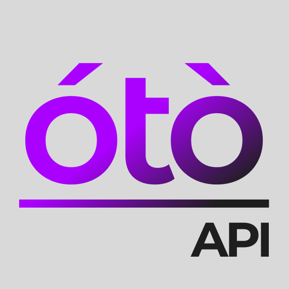

<div align="center">
  
</div>

# Otomat API

- [Introduction](#introduction)
- [Usage](#usage)
  - [Example Request](#example-request)
  - [Example Response](#example-response)
- [Otomat Solution](#otomat-solution)
- [Contribute](#contribute)
- [License](#license)

## Introduction

Otomat API is a powerful wrapper built around the OpenAI GPT API, created with the aim to simplify its utilization and enhance its capabilities. Developed using Node.js and Express, this API serves as an intermediate layer that adds substantial value to the core features provided by OpenAI GPT.

Besides, Otomat API not only allows you to use OpenAI GPT in a classical manner, such as building chatbots, but it is also intended for utilizing GPT's generation capabilities to integrate it into a variety of projects and fields. A key distinction is that Otomat API primarily provides responses in JSON format rather than plain text. This approach allows for leveraging GPT’s capabilities programmatically, making it significantly more versatile and adaptable.

The JSON responses can contain structured data that can be easily parsed and utilized in different systems, enabling seamless integration into applications, data processing pipelines, analytics systems, and much more. Essentially, by utilizing Otomat API, you unlock the potential to employ GPT's powerful content generation in an infinite number of ways across diverse domains.

Key Enhancements Include:
- **JSON Output**: Otomat API primarily generates structured JSON responses, which allows for programmatic utilization of GPT's capabilities, making it significantly more versatile and adaptable for integration into various systems.
- **Function API**: A unique feature that enables passing endpoints as functions. Otomat API will autonomously call the specified functions and chain generations as required, allowing for streamlined and dynamic content generation workflows.
- **Response Format Validation and Automatic Retries**: Ensures that responses are in the correct format, providing an additional layer of data integrity. Additionally, Otomat API automatically retries in cases where the OpenAI GPT API does not immediately return a valid result.

## Usage

1. Clone this repository

2. Navigate to the project directory and launch the server using the command:
```
npm start
```

The API is then available and can be accessed via the `/generate` endpoint using the HTTP POST method.

### Example Request

```json
POST /generate
Content-Type: application/json

{
  "instructions": {
    "prompt": "Your prompt here",
    "output": {
      "schema": {
        "type": "object",
        "properties": {
          "property1": {
            "type": "string"
          }
        },
        "required": ["property1"]
      }
    }
  },
  "settings": {
    "context": "default",
    "model": "your-model"
  },
  "data": "Your data here"
}
```

### Example Response

```json
{
    "type": "json",
    "data": {
        "property1": "Generated content"
    },
    "meta": {
        "version": "0.1.0",
        "model": "your-model",
        "cost": 0.001,
        "retries": 0,
        "process": {
            "module1": {
                "status": "success",
                "module": "module1",
                "options": {}
            }
        }
    }
}
```

## Otomat Solution

🟢: Available and maintained.

🟡: In development.

🔴: Planned.

### API
- 🟢 **[otomat-ai/api](https://github.com/otomat-ai/api)** - API server.

### CORE
- 🔴 otomat-ai/core - Core feature in Typescript.

### FULL
- 🔴 otomat-ai/full-ts - Full TypeScript solution including both the client and core for local implementation.

### CLIENTS
- 🔴 otomat-ai/client-ts - TypeScript client library.
- 🔴 otomat-ai/client-py - Python client library.
- 🔴 otomat-ai/client-net - .NET client library.
- 🔴 otomat-ai/client-java - Java client library.
- 🔴 otomat-ai/client-go - Golang client library.
- 🔴 otomat-ai/client-swift - Swift client library.
- 🔴 otomat-ai/client-rust - Rust client library.
- 🔴 otomat-ai/client-dart - Dart client library.
- 🔴 otomat-ai/client-ruby - Ruby client library.
- 🔴 otomat-ai/client-php - PHP client library.

## Contribute

Contributions are welcome! If you wish to contribute to the project, please fork the repository and propose your changes via a Pull Request.

## License

This project is licensed under the GNU General Public License.
